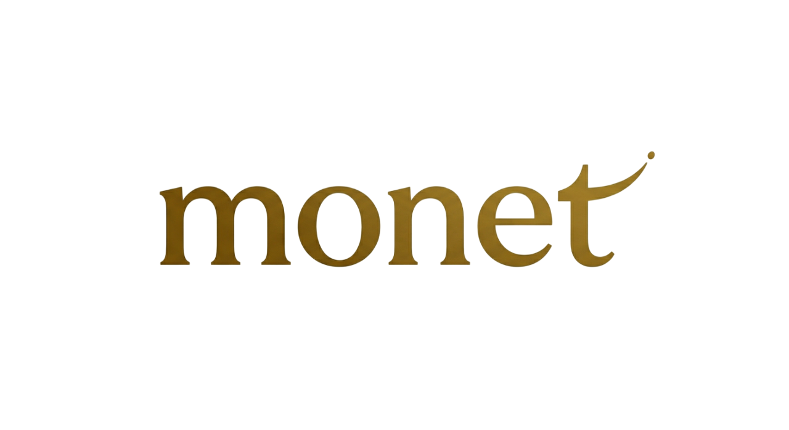

# Monet — Personal Finance App

<p align="center">
	
</p>

Monet is a modern, privacy-first personal finance app built with Tauri, React, and TypeScript. It helps you track accounts, transactions, categories, and budgets—all securely on your device.

## Features

- **Accounts**: Manage checking and savings accounts
- **Transactions**: Add, edit, and categorize income/expenses
- **Categories**: Organize spending with custom and default categories
- **Budgets**: Set monthly limits per category (future)
- **Biometric Security**: Local authentication (WebAuthn/biometric)
- **Offline-first**: All data stays on your device

## Getting Started

### Prerequisites
- [Node.js](https://nodejs.org/) (v18+ recommended)
- [Rust](https://www.rust-lang.org/tools/install)
- [Tauri CLI](https://tauri.app/v1/guides/getting-started/prerequisites/)

### Setup

```bash
git clone https://github.com/yourusername/monet.git
cd monet
npm install
npx tauri dev
```

## Development

- Main UI: React + Vite (see `src/`)
- Backend: Rust (see `src-tauri/`)
- Database: SQLite (encrypted, local only)

## Security & Open Source

**No sensitive data is present in this repository.**

- All credentials are generated per-user at runtime.
- No API keys or secrets are stored in code.
- **Before publishing:** Add `src-tauri/passkey.json` to your `.gitignore` to avoid leaking local test credentials.

## Contributing

Pull requests are welcome! Please open an issue to discuss major changes first.

## License

MIT
